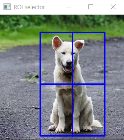
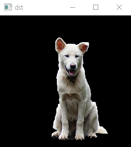
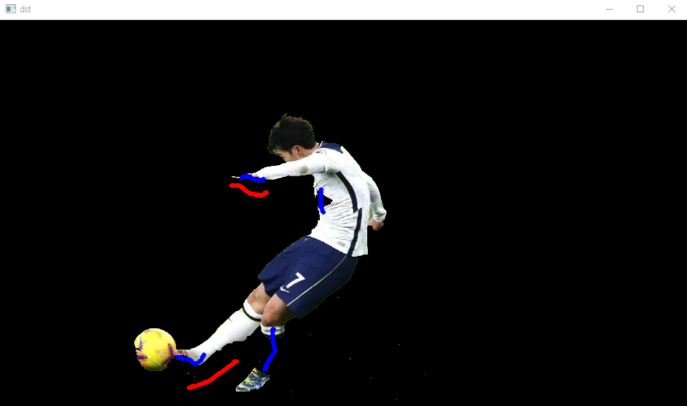
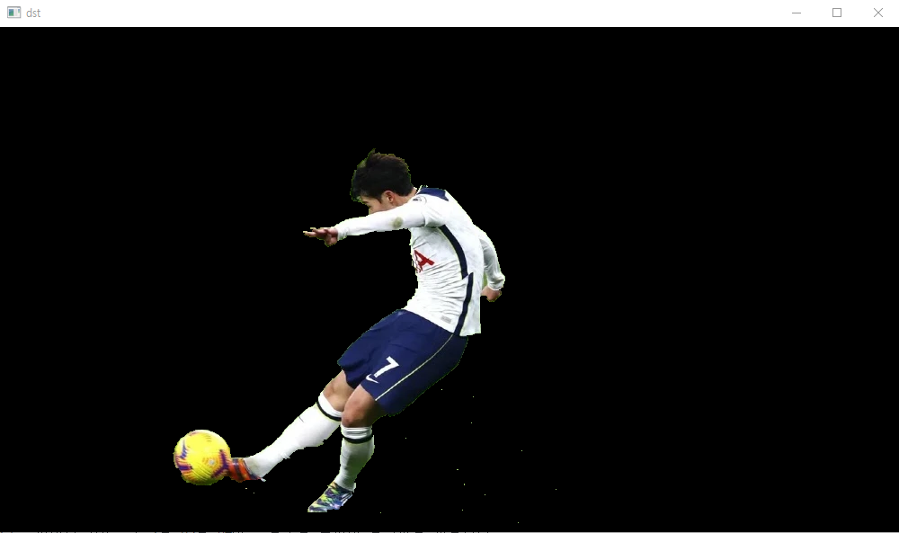

# cv2.grabCut 함수 테스트 

그랩컷은 2가지 방법으로 수행할 수있다.

1. 객체의 위치를 사각형 형태로 입력
2. 객체 부분과 배경 부분을 마우스로 지정해서 입력

이번 테스트는 1번 방법에 대한 코드이다.
```python
import numpy as np
import cv2

src = cv2.imread('./source/dog.bmp')

if src is None: raise Exception('Image load failed')

rc = cv2.selectROI(src, True, False)                                # 마우스 드래그로 roi 영역을 설정
print(rc)

mask = np.zeros(src.shape[:2], np.uint8)

cv2.grabCut(src, mask, rc, None, None, 5, cv2.GC_INIT_WITH_RECT)    # mask 값이 변경된다.

mask2 = np.where((mask == 0) | (mask == 2), 0, 1).astype(np.uint8)

dst = src * mask2[:, :, np.newaxis]                                 # src는 컬러 영상이므로 차원을 맞춰줌

cv2.imshow('dst', dst)
cv2. waitKey()
cv2.destroyAllWindows()
```
+ **cv2.selectROI(arg1, arg2, arg3, arg4)**
  - arg1(winname): 윈도우 창 이름
  - arg2(img): 윈도우 창에 표시할 이미지
  - arg3(showCrossHair=True): 선택 영역 중심에 십자 모양 표시 여부
  - arg4(fromCenter=False): 마우스 시작 지점을 영역의 중심으로 지정



---
+ **cv2.grabCut(arg1, arg2, arg3, arg4, arg5, arg6)**
  - arg1(img): 입력 영상, 8비트 3채널
  - arg2(mask): 입출력 마스크
  - arg3(roi): 객체를 포함하는 roi 
  - arg4(bgdModel): 임시 배경 모델 행렬
  - arg5(fgdModel): 임시 전경 모델 행렬
  - arg6(iterCount): 결과 생성을 위한 반복 횟수
  - arg7(mode): cv2.GC_ 로 시작하는 모드 상수, cv.GC_INIT_WITH_RECT 인자는 제공된 arg3(roi) 값을 가지고 arg2(mask)를 초기화 한다.

grabCut 함수를 거친 mask 행렬에는 0,1,2,3 값을 지닌 원소들로 채워지는데 0,2는 배경, 1,3은 객체를 의미한다.

참고로 0은 명백한 배경, 1은 명백한 객체, 2는 배경일 수도 있는 영역, 3은 객체일 수도 있는 영역을 의미한다.

numpy.where 함수를 사용해서 배경 영역을 0, 객체 영역을 1로 설정한 mask2 행렬을 생성한다.



---
+ **np.where(arg1,arg2,arg3)**
  - arg1(condition): 조건문
  - arg2(x): 조건문이 True일때 치환할 값
  - arg3(y): 조건문이 False일때 치환할 값

---

아래 테스트는 2번 방법에 대한 코드이다. [selectROI로 일차적으로 그랩컷을 수행한 후 마우스 이벤트 함수를 통해 추가적으로 그랩컷 수행]
```python
import numpy as np
import cv2

src = cv2.imread('./source/son.jpg')

if src is None: raise Exception('image load failed')

mask = np.zeros(src.shape[:2], np.uint8)
bgdModel = np.zeros((1,65), np.float64)
fgdModel = np.zeros((1,65), np.float64)

rc = cv2.selectROI(src)

cv2.grabCut(src, mask, rc, bgdModel, fgdModel, 1, cv2.GC_INIT_WITH_RECT)

mask2 = np.where((mask == 0) | (mask == 2), 0, 1).astype(np.uint8)
dst = src * mask2[:,:, np.newaxis]
 
cv2.imshow('dst',dst)

def onMouse(event, x, y, flags, param):                     # 마우스 왼쪽 버튼 드래그 --> 객체, 오른쪽 --> 배경
    if event == cv2.EVENT_LBUTTONDOWN:
        cv2.circle(dst, (x,y), 3, (255,0,0), cv2.FILLED)
        cv2.circle(mask, (x,y), 3, cv2.GC_FGD, cv2.FILLED)
        cv2.imshow('dst',dst)
    
    elif event == cv2.EVENT_RBUTTONDOWN:
        cv2.circle(dst, (x,y), 3, (0,0,255),cv2.FILLED)
        cv2.circle(mask, (x,y), 3, cv2.GC_BGD, cv2.FILLED)
        cv2.imshow('dst',dst)

    elif event == cv2.EVENT_MOUSEMOVE:
        if flags & cv2.EVENT_FLAG_LBUTTON:
            cv2.circle(dst, (x,y), 3, (255,0,0), cv2.FILLED)
            cv2.circle(mask, (x,y), 3, cv2.GC_FGD, cv2.FILLED)
            cv2.imshow('dst',dst)

        if flags & cv2.EVENT_FLAG_RBUTTON:
            cv2.circle(dst, (x,y), 3, (0,0,255), cv2.FILLED)
            cv2.circle(mask, (x,y), 3, cv2.GC_BGD, cv2.FILLED)
            cv2.imshow('dst',dst)    

cv2.setMouseCallback('dst', onMouse)

while True:
    key = cv2.waitKey()
    if key == 13:
        cv2.grabCut(src, mask, rc, bgdModel, fgdModel, 1, cv2.GC_INIT_WITH_MASK)
        mask2 = np.where((mask== 0) | (mask == 2) , 0, 1).astype(np.uint8)
        dst = src * mask2[:,:, np.newaxis]
        cv2.imshow('dst',dst)

    elif key == 27: break

cv2.destroyAllWindows()
```

추가로 사용한 기능은 arg4, arg5에 기술한 bgdModel, fgdModel과 arg7의 mode 인자에 기술한 cv2.GC_INIT_WITH_MASK 이다.

bgdModel, fgdModel를 지정해주면 재귀적인 방식으로 더욱 최적의 결과를 도출해낼 수 있음.

파이썬 기준으로 1행 65열 64비트 실수형 넘파이 행렬값을 사용한다.

cv2.GC_INIT_WITH_MASK 인자는 사용자가 설정한 mask를 기반으로 그랩컷을 수행할 때 사용한다. 위 코드에서는 마우스 이벤트가 발생한 위치의 mask 원소 값을 변경해서 사용한다.



 

---
